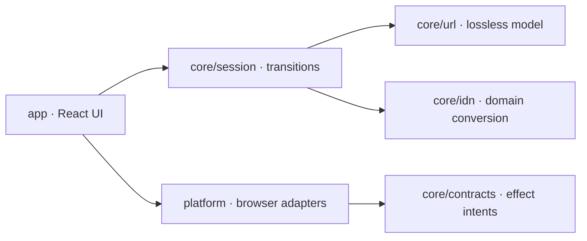
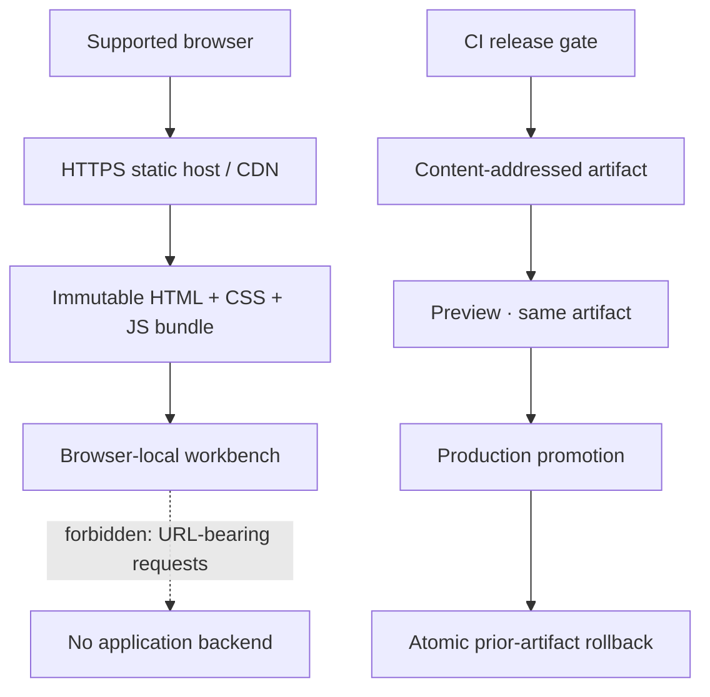
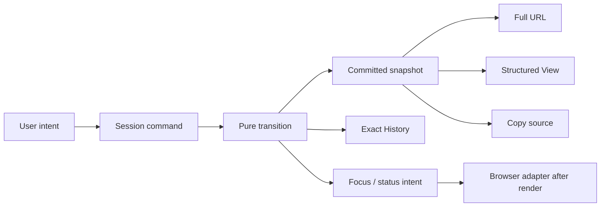

# Architecture Spine — URL Piece Management

## Design Paradigm

**Functional Core / Imperative Shell with unidirectional state transitions.**

`core` owns URL semantics and state transitions. `app` maps user intents to core
commands and renders state. `platform` performs clipboard, focus, and browser
effects requested by the core. Dependencies point inward only.



## Invariants & Rules

### AD-1 — One transactional session authority [ADOPTED]

- **Binds:** FR-10..FR-16, NFR-4..NFR-7
- **Prevents:** Full URL, Structured View, History, and Copy choosing different
  committed states or mutation order.
- **Rule:** One session reducer owns Draft URL, Current/Last Valid snapshot,
  lossless structured model, History, local field drafts, and effect intents.
  Every accepted command returns one atomic state; components and adapters may
  never mutate committed URL state independently.

### AD-2 — Lossless URL core with WHATWG acceptance [ADOPTED]

- **Binds:** FR-1..FR-3, FR-6..FR-12, NFR-5..NFR-7, AG-1
- **Prevents:** Browser canonicalization, `URLSearchParams`, or generic string
  splitting from merging entries or rewriting untouched URL text.
- **Rule:** The WHATWG `URL` implementation is the HTTP/HTTPS acceptance and
  host-semantics oracle, not the round-trip serializer. A custom scanner owns
  `LosslessUrl`: exact scheme and authority slots; ordered path segments with
  empty/trailing entries; query-presence plus ordered entries shaped as
  `{id, separatorBefore, rawKey, equalsPresent, rawValue}`; and
  `{fragmentPresent, rawFragment}`. Literal structural delimiters alone split
  tokens; percent-encoded delimiters never do. Userinfo, port, and every
  unmanaged authority lexeme remain opaque and exact. A mutation may replace
  only its target token and delimiters whose presence that operation changes.

### AD-3 — One component-text codec [ADOPTED]

- **Binds:** FR-3, FR-6..FR-9, NFR-5..NFR-7, AG-1
- **Prevents:** Double encoding, encoded delimiters becoming structure, and
  different editors applying incompatible percent rules.
- **Rule:** All non-domain Managed Piece fields display and edit **raw URL
  component text**, not decoded text. Each edit command carries the prior token
  revision, DOM-compatible UTF-16 `selectionStart`/`selectionEnd`, and
  `insertedText`. The reducer rejects a stale revision or a range that splits an
  existing percent triplet; it never rebases ranges. Only `insertedText` passes
  through the codec; untouched prefix and suffix ranges retain exact bytes.
  Replacing raw Unicode with the same visible Unicode is therefore an edit and
  encodes the inserted span. One codec tokenizes inserted text left-to-right:
  complete `%[0-9A-Fa-f]{2}` triplets are opaque and retain their bytes and hex
  casing; a bare or partial `%` rejects the commit. Literal `+` remains `+`;
  Unicode is never normalized and new Unicode is UTF-8 percent-encoded with
  uppercase hex. New path text percent-encodes the WHATWG path set plus `/` and
  `\`; query keys encode the special-query set plus `&` and `=`; query values
  encode the special-query set plus `&`. These exhaustive profiles include C0
  controls, space, `"`, `#`, `<`, and `>`; the path profile additionally
  includes `?`, `^`, `` ` ``, `{`, and `}`, and the special-query profile
  includes `'`. A malformed sequence already accepted in a Full URL remains
  visible with a field error until corrected; every untouched substring remains
  byte-identical through unrelated mutations and Copy.

### AD-4 — Deterministic dual IDN conversion [ADOPTED]

- **Binds:** FR-3, FR-6, FR-12, NFR-7, NFR-15, AG-2
- **Prevents:** Unicode and ASCII/Punycode editors accepting different domains
  or serializing an ambiguous host.
- **Rule:** Both directions use `tr46` 6.0.0 with
  `transitionalProcessing: false`, `checkBidi: true`, `checkJoiners: true`,
  `checkHyphens: false`, `useSTD3ASCIIRules: false`,
  `verifyDNSLength: false`, and `ignoreInvalidPunycode: false`, then validate
  the ASCII result through WHATWG HTTP/HTTPS host rules. The focused form owns
  its draft; only successful conversion commits both forms. Standards-valid
  mixed-script hosts are not rejected by an invented safety policy; both
  bidi-isolated forms and explicit conversion status remain visible. An
  untouched accepted host retains its source lexeme. Editing either form
  serializes the committed host as lowercase ASCII/Punycode.

### AD-5 — Snapshot history owns identity [ADOPTED]

- **Binds:** FR-5, FR-7..FR-14, NFR-4..NFR-7, NFR-13, NFR-15
- **Prevents:** Undo restoring an equivalent but different serialization,
  duplicate rows swapping identity, or focus targeting an absent/recreated item.
- **Rule:** Each History Entry stores the complete before/after committed
  snapshot: exact serialization, lossless model, and immutable piece IDs.
  Piece IDs are session-local, opaque, and never recycled. Transitions emit
  focus intents by ID; the shell mounts the target before applying focus.
  Search and local invalid field drafts are not History. Full URL reparsing
  preserves the Domain ID, then reconciles path and query IDs independently by
  an exact-token longest common subsequence. A path token key is `rawSegment`;
  a query token key is `{rawKey, equalsPresent, rawValue}` and excludes
  `separatorBefore`. Ties resolve by earliest old position then earliest new
  position; every unmatched new token receives a fresh ID. Undo restores the
  IDs held by its snapshot.

### AD-6 — Close-and-rebase is a state transition [ADOPTED]

- **Binds:** FR-10..FR-14, NFR-4..NFR-6
- **Prevents:** Invalid Full URL drafts erasing structured changes or creating a
  stale history branch.
- **Rule:** A Full URL focus session captures one committed baseline and updates
  its last accepted valid snapshot without appending per-keystroke History.
  Blur or Enter closes at most one baseline-to-last-valid entry. Before any
  other product mutation, the same reducer transaction first closes the Full
  URL edit and appends that entry when the two snapshots differ; it then applies
  the product mutation against Last Valid and appends a separate chronological
  entry. Invalid Draft text remains unchanged. A later valid Full URL input
  starts from the latest Last Valid snapshot and, when closed, appends one
  latest-last-valid-to-corrected entry; it never replaces or merges prior
  structured entries. Therefore the first Undo always reverses the most recent
  committed product intent. The controller dispatches
  `beginFullUrlEdit`, `inputFullUrl`, and `closeFullUrlEdit(reason)` explicitly;
  blur, Enter, and every non-Full-URL command that can commit a URL mutation
  first dispatch `closeFullUrlEdit` in the same reducer transaction, so DOM
  event ordering cannot change History. Search, focus, selection, scrolling,
  and non-mutating validation neither close the edit nor create History.

### AD-7 — Full DOM is the V1 accessibility representation [ADOPTED]

- **Binds:** FR-2, FR-4..FR-9, NFR-8..NFR-17, AG-3
- **Prevents:** Visual windowing from omitting rows in screen-reader browse mode
  or breaking identity and focus.
- **Rule:** Render every Managed Piece in one semantic list at the supported
  250+ entry limit. V1 may not ship virtualization. Reopen this decision only
  after capacity evidence misses its targets and a proposed implementation
  passes the UX virtualization-on/off equivalence matrix.

### AD-8 — Local synchronous parsing first [ADOPTED]

- **Binds:** FR-1..FR-3, FR-10..FR-12, NFR-8..NFR-10
- **Prevents:** Premature worker concurrency from publishing stale or partial
  models and duplicating parser behavior.
- **Rule:** Parsing and serialization execute synchronously in the pure core and
  publish through one reducer transition. Scheduled Full URL parses carry an
  input snapshot, monotonic generation, session epoch, and originating committed
  revision. Publication requires all four to match current reducer state.
  Every accepted product mutation advances the session epoch and invalidates
  every pending parse in the same transaction; stale completions acknowledge
  without publishing state. `core/session` alone owns epoch, generation, busy,
  validation, and publication state; the UI cannot publish parser results or
  partial rows.
  Add a Web Worker adapter only if reference-hardware profiling exceeds 50 ms
  p95; the worker must call the same core and return complete results only.

### AD-9 — URL content has no external sink [ADOPTED]

- **Binds:** NFR-1..NFR-3, NFR-5, FR-15
- **Prevents:** URL, Draft, History, or clipboard content leaking through
  diagnostics, storage, telemetry, navigation, or background facilities.
- **Rule:** URL-bearing failures are typed local values with stable non-content
  codes. No URL content enters console logs, analytics, crash reports,
  performance traces, Web Storage, IndexedDB, cookies, query strings, or
  outbound requests. Production CSP includes `connect-src 'none'`; no service
  worker is registered. The remaining policy floor is `default-src 'self';
  script-src 'self'; style-src 'self'; img-src 'self' data:; object-src 'none';
  base-uri 'none'; form-action 'none'; frame-ancestors 'none'`.

### AD-10 — Static, environment-invariant delivery [ADOPTED]

- **Binds:** all
- **Prevents:** Preview and production acquiring different URL behavior or a
  server-side content path.
- **Rule:** Build one immutable client bundle and serve it over HTTPS in preview
  and production. Environment differences are deployment metadata only; there
  are no runtime feature/config branches and no server application. Clipboard
  support and the browser matrix are release gates. Vite uses `base: './'` so
  one artifact can run at a provider subpath. Fingerprinted assets are cached
  `public, max-age=31536000, immutable`; `index.html` uses `no-cache`. Promotion
  copies the already-tested artifact; rollback restores the preceding artifact
  and headers as one release unit.

### AD-11 — Shared executable acceptance corpus [ADOPTED]

- **Binds:** FR-1..FR-16, NFR-1..NFR-17, AG-1..AG-3
- **Prevents:** Unit, component, and browser tests proving different URL,
  history, identity, privacy, or accessibility contracts.
- **Rule:** One versioned fixture corpus drives core golden tests, component
  interaction tests, and browser acceptance. It includes encoded delimiters,
  malformed percent text, empty/absent values, duplicate entries, exact
  close-and-rebase history, IDN/RTL cases, 20,000-character and 250+ entry
  capacity, forbidden outbound/storage behavior, and exact Copy/Undo strings.

### AD-12 — One keyboard and composition arbiter [ADOPTED]

- **Binds:** FR-10, FR-14, NFR-12..NFR-16
- **Prevents:** Components disagreeing about native Undo, product Undo, Enter,
  IME composition, or pointer cancellation.
- **Rule:** `app/workbench/inputArbiter` is the only global keyboard/pointer
  command adapter. It never intercepts platform Undo in `input`, `textarea`,
  editable `select`, `contenteditable` descendants, an editing-host selection,
  or while `isComposing`; elsewhere primary-modifier `z` without Alt/AltGraph
  dispatches product Undo. Enter/Shift+Enter cannot close or mutate Full URL
  during composition. Product actions dispatch only from click/up activation,
  never pointer-down.

### AD-13 — Effects are revisioned commands with acknowledgements [ADOPTED]

- **Binds:** FR-7..FR-9, FR-14..FR-16, NFR-4, NFR-13..NFR-15
- **Prevents:** Replayed clipboard/focus/status effects, focus before render,
  failed Copy appearing successful, or feedback channels overwriting each other.
- **Rule:** Each transition may append an `EffectIntent` carrying monotonic
  `effectId`, originating `stateRevision`, kind, and typed payload. The shell
  executes strictly serially after commit: it starts `effectId n+1` only after
  `n` reaches exactly one reducer acknowledgement. Async adapters have typed,
  bounded timeout outcomes. Non-clipboard stale outcomes acknowledge without
  committed-state changes or new effects. Immediately before invoking any
  non-clipboard adapter, the executor dispatches a reducer-owned `claimEffect`
  transition; a mismatched revision or typed target precondition acknowledges
  the intent without invoking the adapter or touching the DOM. No
  operation-specific focus intent survives a revision change.

  A Copy intent captures `attemptedSerialized`. Before invoking the Clipboard
  API, the executor cancels it if that value is no longer the current Copy
  source, acknowledges it as superseded, and emits non-success feedback. Once
  invoked, a user-visible timeout does not mark the underlying non-cancellable
  write settled; that first timeout immediately creates safe-copy recovery from
  the attempt's captured serialization while retaining the unresolved-write
  fence. While that write remains unresolved, a later Copy attempt becomes the
  new `latestCopyAttemptId`, replaces recovery with its own captured
  serialization, and does not invoke the Clipboard API. Every eventual success,
  failure, or timeout is reported truthfully, but an outcome older than
  `latestCopyAttemptId` cannot create, focus, or retain recovery. Current
  failure recovery creates `safe-copy-readonly` from the exact attempted value,
  preserves Draft and History, focuses and selects it, exposes persistent
  actionable guidance for native keyboard, touch, VoiceOver, and TalkBack Copy,
  and keeps it until the next Copy attempt or URL mutation.

  Focus intents are typed by operation and implement the complete UX
  operation/Undo transition tables, including same/opposite-subcontrol, Clear
  Search, after-list Add, Structured View heading, Full URL, and filtered-item
  announcements. A nearest-row tie searches next then previous in
  post-transition source order.

  `core/session` owns separate validation, polite FIFO/coalescing, and
  actionable-alert queues and implements every UX timing, precedence,
  coalescing, repeat-node, IME-suppression, and persistence rule. When a
  committed outcome would start after six seconds, every committed outcome
  participating in that overflow—including the currently exposed, pending,
  and incoming outcomes—is copied exactly once into persistent operation
  history. Pending committed outcomes leave the FIFO; the current message
  completes its minimum exposure; one summary is enqueued with the count of all
  promoted outcomes. Components only render these reducer-owned states.

### AD-14 — Release evidence is an architecture gate [ADOPTED]

- **Binds:** UJ-1, SM-1..SM-4, NFR-8..NFR-17, AG-1..AG-3
- **Prevents:** A semantically correct unit suite from shipping an inaccessible,
  browser-specific, slow, or privacy-leaking integration.
- **Rule:** An implementation story touching AG-1, AG-2, or AG-3 is blocked
  until that gate's prototype or fixture exit evidence passes. Release is
  blocked until the shared corpus passes: exact semantic
  and History goldens; 1-second initial parse and 100 ms interaction targets on
  4-core/8-GB reference hardware; latest-two-major Chrome, Firefox, Edge, and
  Safari; the named desktop/mobile browser-AT matrix; keyboard, IME, focus,
  320px/400% reflow, forced-colors, text-spacing, network/storage, clipboard
  fallback, and WCAG 2.2 AA checks; plus 5–8 representative developers with at
  least 90% unassisted completion and zero critical synchronization, Undo, or
  stale-Copy failures. AG-1 through AG-3 are **design closed; implementation
  evidence pending** until a versioned matrix maps every bound FR, NFR, UX case,
  and gate fixture to an automated or manual result with no required cell
  missing. One versioned, machine-validated evidence manifest and evaluator is
  the sole implementation-entry and release oracle. The schema fixes required
  cell IDs, story-to-gate mapping, evidence owner/sign-off, and terminal states;
  a mandatory cell passes only as `pass`, never `waived`, `skipped`, or merely
  present. Representative-user success is whole-journey participants completing
  unassisted divided by all participants, without rounding, and must be at least
  0.90. A critical synchronization failure is any settled view or Copy source
  differing from its committed snapshot; a critical Undo failure is any
  mismatch in the prior exact serialization, identity, or required focus; a
  critical stale-Copy failure is any write/recovery not equal to its attempt's
  captured serialization or any older attempt overwriting a newer one. Any such
  failure blocks the gate. Exact tested versions, artifact digest, matrix
  version, evaluator version, and evidence links attach to the release record.

## Consistency Conventions

| Concern | Convention |
| --- | --- |
| Source precedence | The PRD owns capability and quality scope; `EXPERIENCE.md` owns later interaction resolutions, including structured editing during an invalid Draft and close-and-rebase behavior; this spine owns technical realization. |
| Feature modules | `core/<domain>` exports pure types/functions; `app/<feature>` exports React views/controllers; `platform/<adapter>` implements browser effects. |
| Names | Commands use imperative verbs (`editPiece`, `commitFullUrl`); events/effect intents use completed or requested facts (`pieceEdited`, `focusRequested`); React components use PascalCase. |
| Identity | `PieceId` and `HistoryEntryId` are opaque branded strings allocated only by the session core; ordinals and array indexes are never identity. |
| Results | User-controlled input returns `Result<T, UrlProblem>` with stable `code`, `field`, and safe message key; expected validation never throws. |
| State mutation | Commands enter through the session reducer. Core values are immutable; adapters receive effect intents after state publication. |
| Serialization | `snapshot.serialized` is the sole Copy source. UI never reconstructs a URL and never reads a field collection to Copy. |
| Accessibility IDs | Derive stable DOM/error IDs from opaque Piece IDs plus field kind; never from filtered position. |
| Logging | Production application code emits no URL-bearing logs. Tests assert codes and fixtures, not production logging side effects. |
| Styling | Native HTML first; CSS Modules consume the committed design tokens. No component library or CSS-in-JS runtime. |

## Architecture Gate Closure

| Gate | Closure | Required evidence |
| --- | --- | --- |
| AG-1 — Parser/serializer | Design closed by AD-2, AD-3, AD-5, AD-6, and AD-11; evidence pending | Cross-browser goldens cover Draft/Current/Last Valid, untouched casing and delimiters, malformed percent text, Fragment, exact History, restored serialization, and Copy. |
| AG-2 — IDN | Design closed by AD-4 and AD-11; evidence pending | Bidirectional fixtures include `faß.de`, combining-mark equivalents, Arabic/Hebrew labels, uppercase Punycode, deviation characters, invalid Punycode, and mixed-script confusables. |
| AG-3 — Accessible virtualization | Design closed for V1 by AD-7; evidence pending | Full-DOM 250+ fixture exposes every row exactly once in browse/focus modes; no virtualization equivalence claim is needed. |

## Stack

| Name | Version |
| --- | --- |
| Node.js | 24 LTS |
| pnpm | 12.5.1 |
| create-vite | 9.2.1 |
| React / React DOM | 19.3.0 |
| Vite | 8.3.1 |
| @vitejs/plugin-react | 6.1.1 |
| TypeScript | 6.0.2 |
| oxlint | 1.81.0 |
| tr46 | 6.0.0 |
| Vitest | 5.0.1 |
| Testing Library React | 16.3.3 |
| Testing Library DOM | 10.4.2 |
| Testing Library user-event | 14.6.7 |
| jsdom | 30.1.1 |
| @playwright/test | 1.63.0 |
| @axe-core/playwright | 4.13.0 |

## Structural Seed

```text
src/
  core/
    url/          # lossless scanner, codec, serializer, fixtures contract
    idn/          # UTS #46 conversion and host validation
    session/      # commands, reducer, snapshots, history, focus intents
    contracts/    # Result, problem codes, branded IDs, effect intents
  app/
    workbench/    # Full URL, Actions, Structured View orchestration
                   # and the sole keyboard/composition input arbiter
    pieces/       # Domain, path, and query row components
    feedback/     # renderers for reducer-owned validation/status/alert queues
  platform/
    clipboard/    # copy and safe-copy outcome adapter
    effects/      # revisioned effect execution and acknowledgement
    focus/        # render-ready focus resolution and fallback executor
  styles/         # committed tokens and responsive CSS Modules
  test/
    fixtures/     # shared semantics, history, IDN, capacity corpus
```





## Capability → Architecture Map

| Capability / Area | Lives in | Governed by |
| --- | --- | --- |
| Intake and exact structure (FR-1..FR-3) | `core/url`, `core/idn` | AD-2..AD-4 |
| Search and piece identity (FR-4..FR-5) | `core/session`, `app/pieces` | AD-5, AD-7 |
| Structured editing (FR-6..FR-9) | `core/url`, `core/session` | AD-1..AD-5 |
| Full URL synchronization (FR-10..FR-12) | `core/session`, `app/workbench` | AD-1..AD-3, AD-6, AD-8 |
| History and Undo (FR-13..FR-14) | `core/session`, `platform/focus` | AD-1, AD-5, AD-6 |
| Copy and feedback (FR-15..FR-16) | `platform/clipboard`, `app/feedback` | AD-1, AD-5, AD-9, AD-13 |
| Input and composition | `app/workbench/inputArbiter` | AD-6, AD-12 |
| Privacy and lifecycle (NFR-1..NFR-7) | all boundaries and deployment | AD-1, AD-2, AD-5, AD-9, AD-10 |
| Capacity and accessibility (NFR-8..NFR-17) | UI, fixtures, release suite | AD-7, AD-8, AD-11..AD-14 |

## Deferred

| Decision | Revisit condition |
| --- | --- |
| Static hosting/CDN provider and CI vendor | Delivery constraints name a provider; the bundle and CSP contract remain unchanged. |
| Web Worker parsing | Reference-hardware parsing exceeds 50 ms p95 or interaction exceeds the 100 ms target. |
| Accessible virtualization | Full-DOM capacity fails and an equivalence prototype passes every AG-3 browser/AT case. |
| Routing, SSR, server functions, API, persistence, telemetry, and service workers | A post-V1 requirement changes the explicit local-only single-workbench boundary. |
| Redo and bounded History retention | Product scope introduces Redo or a measured session-memory limit conflicts with complete Undo. |
